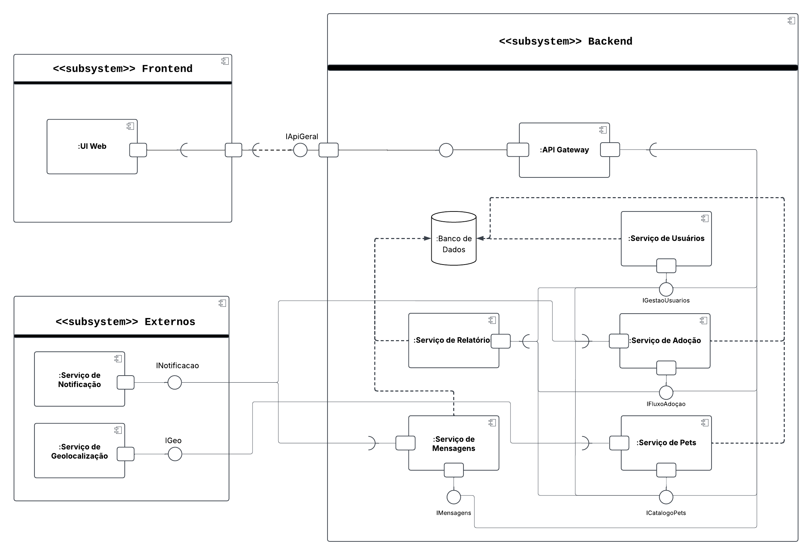

# Diagrama de Componentes

## **Introdução**

O **diagrama de componentes** é um dos diagramas estruturais da **Unified Modeling Language (UML)** e tem como objetivo principal representar a organização e as dependências entre os componentes de um sistema de software.

Este diagrama é utilizado para modelar a estrutura física de um sistema, mostrando como ele é dividido em **componentes modulares** e como ocorre a comunicação entre eles. Um componente pode ser entendido como uma parte substituível e reutilizável do sistema, como um **serviço**, uma **biblioteca** ou um **subsistema**.

## **Metodologia**

A elaboração do diagrama de componentes para a plataforma **"CuidaDeMim"** foi um esforço colaborativo realizado pelos integrantes **José André Rabelo Rocha** e **Caio Antônio Araújo Garcia de Almeida**. A metodologia foi definida por meio de reuniões de trabalho, documentadas na ata de reunião, onde a arquitetura do sistema foi discutida e modelada.

Para a construção do diagrama, foi utilizada a ferramenta **Lucidchart**. A escolha se deu por sua interface intuitiva e pelos recursos flexíveis para diagramação no formato UML, que permitiram representar de forma clara e precisa os subsistemas (**Frontend, Backend, Externos**), os componentes internos (ex: *:Serviço de Usuários*, *:Serviço de Pets*), suas interfaces, portas e os relacionamentos entre eles.

## **Tabela de Participação na Produção do Artefato**

| 
Nome do Integrante    | 
Artefato| 
Descrição da Contribuição | 
Análise Crítica   | 
Link Comprobatório |
| --- | ---- | --------- | ----| -------------------------- |
| **José André Rabelo Rocha** | Diagrama de Componentes | Participei ativamente da concepção e modelagem da arquitetura geral do sistema, definindo a divisão em subsistemas (Frontend, Backend, Externos) e detalhando os componentes internos, como o *:Serviço de Usuários* e o *:Serviço de Adoção*. | A definição de uma arquitetura baseada em serviços desde o início foi um acerto, pois tornou a separação de responsabilidades muito clara. Um desafio foi garantir que as interfaces entre os componentes fossem bem definidas para evitar acoplamento excessivo, o que facilitará a manutenção e a escalabilidade futura do projeto. | [Ata 01](../Projeto/IniciativasExtras/ata_01.md) |
| **Caio Antônio Araújo Garcia de Almeida** | Diagrama de Componentes | Contribuí na estruturação dos componentes do backend, especialmente no detalhamento do *:Serviço de Pets* e na identificação dos serviços externos necessários, como Geolocalização e Notificação. Fui responsável por garantir a correta aplicação da notação UML, incluindo portas e conectores. | A modelagem dos serviços externos foi um ponto crucial para entendermos as dependências da nossa plataforma. Inicialmente, não tínhamos clareza sobre como representar essas integrações, mas a pesquisa sobre as melhores práticas da UML nos ajudou a criar um diagrama mais robusto e fiel à realidade de uma aplicação web moderna. | [Ata 01](../Projeto/IniciativasExtras/ata_01.md) |

## **Resultados**

**Diagrama de Componentes:**

**Autor(es):** [José André Rabelo Rocha](https://github.com/joseandre25) e [Caio Antônio Araújo Garcia de Almeida](https://github.com/Caio-Antonio)

## **Gravação da Produção do Artefato**

<iframe src="https://unbbr.sharepoint.com/sites/ArqDSW-G4/_layouts/15/embed.aspx?UniqueId=21d47f94-0659-405d-8b6e-19969066efed&embed=%7B%22ust%22%3Atrue%2C%22hv%22%3A%22CopyEmbedCode%22%7D&referrer=StreamWebApp&referrerScenario=EmbedDialog.Create" width="640" height="360" frameborder="0" scrolling="no" allowfullscreen title="Elaboração do Diagrama de Componentes e do de Atividades-20250920_170650-Gravação de Reunião.mp4"></iframe>

<iframe src="https://unbbr.sharepoint.com/sites/ArqDSW-G4/_layouts/15/embed.aspx?UniqueId=69af963a-b0e6-4221-b931-5f6eeb389775&embed=%7B%22ust%22%3Atrue%2C%22hv%22%3A%22CopyEmbedCode%22%7D&referrer=StreamWebApp&referrerScenario=EmbedDialog.Create" width="640" height="360" frameborder="0" scrolling="no" allowfullscreen title="Elaboração do Diagrama de Componentes e do de Atividades-20250920_181215-Gravação de Reunião.mp4"></iframe>

## **Referências Bibliográficas**

> UML DIAGRAMS. Component Diagrams. Disponível em: https://www.uml-diagrams.org/component-diagrams.html. Acesso em: 20 set 2025.

## **Histórico de versões**

| Versão | Data       | Descrição                                                                                             | Autores                            | Revisor |
| ------ | ---------- | ----------------------------------------------------------------------------------------------------- | -------------------------------- | ------- |
| 1.0  | 20/09/2025 | Criação do documento e do diagrama de componentes                  | [José André]() e [Caio Antonio]()   |       |