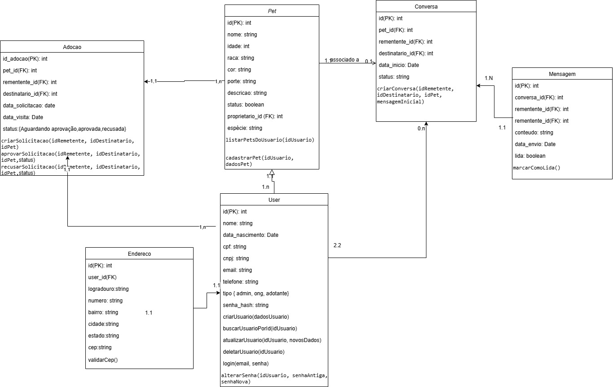

# Diagrama de Classes

## **Introdução**

O **diagrama de classes** é um dos diagramas estruturais mais fundamentais da **Unified Modeling Language (UML)**. Sua finalidade é descrever a estrutura estática de um sistema, representando suas classes, atributos, métodos e os relacionamentos entre esses objetos. Ele oferece uma visão arquitetural do sistema, servindo como um "blueprint" para a construção do software.

Este diagrama é essencial para visualizar a organização lógica do domínio do problema. Ele detalha não apenas as responsabilidades de cada classe, mas também como elas se conectam por meio de relacionamentos como **associação, herança, agregação e composição**, formando a espinha dorsal do modelo de dados e da lógica de negócios.

## **Metodologia**

A elaboração do diagrama de classes para a plataforma **"CuidaDeMim"** foi um esforço colaborativo realizado pelos quatro integrantes do grupo. A metodologia foi definida por meio de reuniões de trabalho, documentadas em atas, onde as entidades centrais do domínio, seus atributos e os relacionamentos entre elas foram discutidos e modelados.

Para a construção do diagrama, foi utilizada a ferramenta **Draw.io**. A escolha se deu por sua robustez e conformidade com a notação UML, o que permitiu representar de forma precisa as classes do sistema (ex: *User*, *Pet*, *Chat*), seus respectivos atributos.

## **Tabela de Participação na Produção do Artefato**

| 
Nome do Integrante | 
Artefato | 
Descrição da Contribuição | 
Análise Crítica | 
Link Comprobatório |
| :--- | :--- | :--- | :--- | :--- |
| **Ian Costa Guimarães** | Diagrama de Classes | Fui responsável por incrementar o diagrama revisando sua semântica, alterei a cardinalidade das classes e revisei ativamente o por que de cada classe estar ali. Sugeri mudanças aos outros membros que iriam incrementar, sugeri adição da classe de endereço e foto | A decisão sobre a cardinalidade é muito importante, já que isso também afeta como nosso banco de dados funcionará, tudo deve estar conciso para fazer sentido junto e não haver ambiguidade na documentação | [Modelagem Assincrona](https://unbbr.sharepoint.com/:v:/s/ArqDSW-G4/Eesdv8N0QR9BsW_p5MG-ta0BhTy4trpN996hKh2j0QsfdA?e=G2vTci&nav=eyJyZWZlcnJhbEluZm8iOnsicmVmZXJyYWxBcHAiOiJTdHJlYW1XZWJBcHAiLCJyZWZlcnJhbFZpZXciOiJTaGFyZURpYWxvZy1MaW5rIiwicmVmZXJyYWxBcHBQbGF0Zm9ybSI6IldlYiIsInJlZmVycmFsTW9kZSI6InZpZXcifX0%3D) |
| **Erick** | Diagrama de Classes | Contribuí com a modelagem da classe *Pet*, detalhando seus atributos (nome, espécie, raça, idade, status) e métodos relacionados, como `marcarComoAdotado()`. Também estabeleci o relacionamento de associação entre *Usuario* e *Pet*. | Definir a multiplicidade do relacionamento entre *Usuario* e *Pet* (um usuário pode ter vários pets, mas um pet pertence a um único usuário no contexto de cadastro) foi um ponto de discussão crucial que impactou diretamente as regras de negócio do sistema. | [Modelagem](https://drive.google.com/file/d/1gKs5PqGjmWsuMpIyxrEsHP3UXdxS-7te/view?usp=sharing) |
| **Vinicius** | Diagrama de Classes | Fiquei encarregado de modelar as classes de associação e de processo, como *Adocao* e *Candidatura*, que conectam as entidades *Usuario* e *Pet*. Detalhei os atributos específicos dessas classes (ex: `dataSolicitacao`, `status`). | Inicialmente, pensamos em uma simples associação entre usuário e pet para adoção, mas a criação de uma classe de associação (*Adocao*) foi fundamental para armazenar informações próprias do processo de adoção, tornando o modelo muito mais rico e fiel à realidade. | [Modelagem](https://unbbr-my.sharepoint.com/:v:/g/personal/190039116_aluno_unb_br/EcwbQYhBYfFLtUv_rWLlPYYBGiJL6tdVuKF0_pIHQpQ5_Q?nav=eyJyZWZlcnJhbEluZm8iOnsicmVmZXJyYWxBcHAiOiJPbmVEcml2ZUZvckJ1c2luZXNzIiwicmVmZXJyYWxBcHBQbGF0Zm9ybSI6IldlYiIsInJlZmVycmFsTW9kZSI6InZpZXciLCJyZWZlcnJhbFZpZXciOiJNeUZpbGVzTGlua0NvcHkifX0&e=mK5cAo) |
| **Daniel Ferreira** | Diagrama de Classes | Realizei a revisão geral do diagrama, focando na correta aplicação dos conceitos de visibilidade (público, privado, protegido) para atributos e métodos. Também ajustei os tipos de relacionamentos, diferenciando agregação de composição onde aplicável e  Adicionei novas classes(Conversa, Mensagem, Endereço, Adoção) | A definição correta da visibilidade dos atributos foi um refinamento importante para o encapsulamento. Discutimos, por exemplo, que a maioria dos atributos deveria ser `private` para forçar o acesso através de métodos `get/set`, o que é uma boa prática de programação orientada a objetos. | [Ata 01](https://unbarqdsw2025-2-turma01.github.io/2025.2-T01-G4_CuidaDeMim_Entrega_02/#/Projeto/IniciativasExtras/ata_01) |

## **Resultados**

**Diagrama de Classes:**

**Autor(es):** Ian , Erick e Vinicius

## **Gravação da Produção do Artefato**

<iframe src="https://unbbr.sharepoint.com/sites/ArqDSW-G4/_layouts/15/embed.aspx?UniqueId=c3bf1deb-4174-411f-b16f-e9e4c1beb5ad&embed=%7B%22ust%22%3Afalse%2C%22hv%22%3A%22CopyEmbedCode%22%7D&referrer=StreamWebApp&referrerScenario=EmbedDialog.Create" width="640" height="360" frameborder="0" scrolling="no" allowfullscreen title="Elaboração Assincrona diagrama de classes-20250922_155810-Gravação de Reunião.mp4"></iframe>

* **Gravação Vinicius:** [Link para a Gravação](https://unbbr-my.sharepoint.com/:v:/g/personal/190039116_aluno_unb_br/EcwbQYhBYfFLtUv_rWLlPYYBGiJL6tdVuKF0_pIHQpQ5_Q?nav=eyJyZWZlcnJhbEluZm8iOnsicmVmZXJyYWxBcHAiOiJPbmVEcml2ZUZvckJ1c2luZXNzIiwicmVmZXJyYWxBcHBQbGF0Zm9ybSI6IldlYiIsInJlZmVycmFsTW9kZSI6InZpZXciLCJyZWZlcnJhbFZpZXciOiJNeUZpbGVzTGlua0NvcHkifX0&e=mK5cAo)

* **Gravação Daniel:** [Link para a Gravação](https://unbbr.sharepoint.com/sites/ArquiteturaeDesenhodeSoftware/Documentos%20Compartilhados/General/Recordings/Reuni%C3%A3o%20em%20General-20250922_191411-Grava%C3%A7%C3%A3o%20de%20Reuni%C3%A3o.mp4?web=1&referrer=Teams.TEAMS-ELECTRON&referrerScenario=MeetingChicletGetLink.view)

## **Referências Bibliográficas**

> UML DIAGRAMS. Class Diagrams. Disponível em: https://www.uml-diagrams.org/class-diagrams.html. Acesso em: 22 set 2025.

## **Histórico de versões**

| Versão | Data       | Descrição                                                                                             | Autores                            | Revisor |
| :--- | :--- | :--- | :--- | :--- |
| 1.0  | 22/09/2025 | Criação do documento e do diagrama de classes inicial     | Ian e Erick   | José       |
| 1.1  | 22/09/2025 | Adição do link comprobatorio    | Erick   | Ian      |
| 1.2 | 22/09/2025 | Adição do link comprobatorio    | Vinicius  | Ian      |
| 1.3 | 22/09/2025 | Adição do link comprobatorio    | Daniel  | Ian      |
