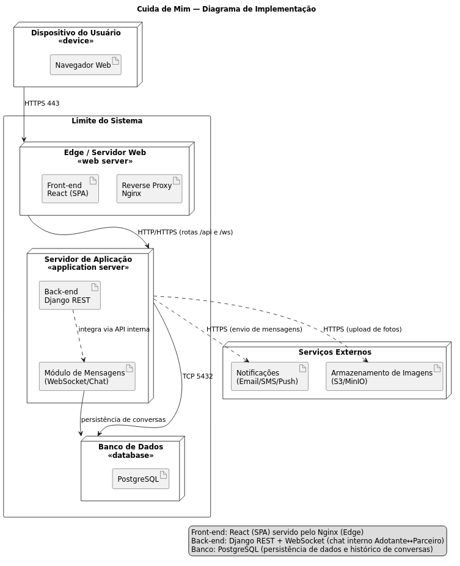

# Diagrama de Implementação

## Introdução

Um **diagrama de implementação** (deployment diagram) é um diagrama de **estrutura** da UML que representa a **arquitetura física** de um sistema, mostrando como os **artefatos** de software são distribuídos (implantados) em **nós de execução** ou **dispositivos** e como se comunicam (protocolos/portas).
Neste artefato, registramos a implantação do *Cuida de Mim*: **Navegador do usuário → Servidor web (Nginx servindo React) → Servidor de aplicação (Django REST/ASGI com WebSocket para chat) → Banco de dados (PostgreSQL)**.

---

## Metodologia

* **Ferramenta:** o diagrama foi **desenhado no draw\.io**, com o estilo visual padronizado (títulos, ícones de nó/artefato, setas com protocolo).
* **Divisão de trabalho (cada um fez uma parte):**

  * **Wallyson**: bloco **Edge/Servidor Web** (Nginx + React), setas externas (HTTPS 443) e rótulos das rotas principais.
  * **Davi de Aguiar**: bloco **Servidor de Aplicação** (Django REST/ASGI + canal **/ws** para WebSocket), camadas lógicas e conexões internas.
  * **Mateus**: bloco **Banco de Dados** (PostgreSQL 5432), relação de persistência do chat e revisão final do layout/legendas.
* **Discussão das tecnologias:** as escolhas de **React**, **Nginx (reverse proxy)**, **Django REST/ASGI (WebSocket para chat interno)** e **PostgreSQL** foram **debatidas com os demais integrantes do grupo**, considerando simplicidade, aderência ao escopo da disciplina e clareza para a documentação.
* **Forma de trabalho:** **assíncrona** (por incompatibilidade de agendas); combinamos tarefas e revisões, com trocas pontuais por mensagem.

> **Observação:** não realizamos reunião síncrona no Microsoft Teams. Toda a coordenação foi **assíncrona**.

---

## Tabela de Participação na Produção do Artefato

| Nome do Integrante | Artefato                             | Descrição da Contribuição                                                                                                                                              | Análise Crítica                                                                                                                                              | 
| ------------------ | ------------------------------------ | ---------------------------------------------------------------------------------------------------------------------------------------------------------------------- | ------------------------------------------------------------------------------------------------------------------------------------------------------------ | 
| **Mateus**         | Diagrama de Implementação (draw\.io) | Modelou o **bloco de Banco de Dados** (PostgreSQL, porta 5432), integrou persistência do **chat** e consolidou o layout/legendas para a publicação.                    | O recorte minimalista deixa o deployment claro; como evolução, podemos acrescentar observações de segurança (HSTS, limites de upload) sem poluir o diagrama. |
| **Davi de Aguiar** | Diagrama de Implementação (draw\.io) | Modelou o **Servidor de Aplicação** (Django REST/ASGI) e indicou o **canal `/ws`** (WebSocket) para mensagens internas, garantindo coerência com o BPMN e Componentes. | Tornar explícito `/api` e `/ws` evita ambiguidade sobre tráfego bidirecional. Sugere-se, futuramente, adicionar nota sobre **reconexão** e **timeouts**.     | 
| **Wallyson**       | Diagrama de Implementação (draw\.io) | Modelou o **Edge/Servidor Web** (Nginx servindo React), setou **HTTPS 443** e organizou as conexões externas; padronizou rótulos e tipografia no draw\.io.             | A centralização do edge simplifica a leitura; manter poucos nós reforça o objetivo pedagógico do artefato.                                                   | 

---

## Resultados

**Diagrama de Implementação (draw\.io):**

  

**Resumo do fluxo:**
**Usuário (Navegador)** → **Nginx servindo React (HTTPS 443)** → **Django REST/ASGI (rotas `/api` e `/ws`)** → **PostgreSQL (TCP 5432)**.

---

## Histórico de Versões

| Versão  | Data       | Descrição                                                                                                                                                                                               | Autor              | Revisor        |
| ------- | ---------- | ------------------------------------------------------------------------------------------------------------------------------------------------------------------------------------------------------- | ------------------ | -------------- |
| **1.0** | 2025-09-20 | **Primeiro rascunho no draw\.io**: criação dos três blocos principais (Edge, App, DB) e setas base.                                                                                                     | **Wallyson**       | Davi de Aguiar |
| **1.1** | 2025-09-21 | **Detalhamento do App**: inclusão de **Django REST/ASGI**, indicação do canal **`/ws`** (WebSocket) e revisão das conexões internas.                                                                    | **Davi de Aguiar** | Mateus         |
| **1.2** | 2025-09-22 | **Ajustes finais e publicação**: bloco de **PostgreSQL 5432**, nota de persistência do **chat**, padronização de rótulos e **integração na GitHub Pages** com Introdução/Metodologia/Tabela/Resultados. | **Mateus**         | Wallyson       |

