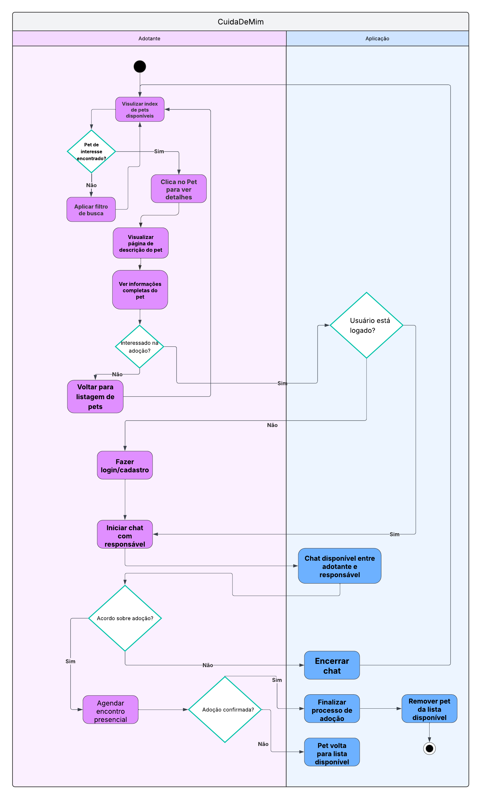

# Diagrama de Atividades

## **Introdução**

O **diagrama de atividades** é um diagrama comportamental da **Unified Modeling Language (UML)** que ilustra o fluxo de trabalho de um sistema, passo a passo. Ele é ideal para modelar a lógica de processos de negócio, mostrando a sequência de ações, os pontos de decisão e os diferentes caminhos que um fluxo pode seguir.

Para a plataforma **"CuidaDeMim"**, o diagrama de atividades foi utilizado para mapear a jornada principal do usuário **Adotante**, desde a busca inicial por um pet até a decisão de iniciar o processo de adoção. O diagrama foca em como o usuário interage com a **Aplicação** para atingir seu objetivo.

## **Metodologia**

A elaboração do diagrama de atividades foi um esforço conjunto dos integrantes **José André Rabelo Rocha** e **Caio Antônio Araújo Garcia de Almeida**, com o objetivo de detalhar o fluxo principal da plataforma. As discussões e o desenvolvimento do artefato foram documentados na ata de reunião correspondente.

A ferramenta **Lucidchart** foi novamente empregada para a construção do diagrama. A utilização de **raias (swimlanes)** permitiu uma clara separação de responsabilidades entre as ações realizadas pelo **Adotante** e as respostas geradas pela **Aplicação**, resultando em um fluxograma lógico e de fácil compreensão sobre a interação entre o usuário e o sistema.

## **Tabela de Participação na Produção do Artefato**

| 
Nome do Integrante | 
Artefato | 
Descrição da Contribuição | 
Análise Crítica | 
Link Comprobatório |
| --- | ---- | --------- | ---- | -------------------------- |
| **José André Rabelo Rocha** | Diagrama de Atividades | Fui responsável por mapear e modelar o fluxo principal do adotante, desde a visualização da lista de pets até a decisão de iniciar o contato. Defini as principais ações do usuário e os pontos de decisão que guiam a sua jornada na plataforma. | O uso de raias foi essencial para distinguir as ações do usuário das respostas do sistema. Acredito que o diagrama cumpre seu objetivo de detalhar a perspectiva do adotante, mas reconheço que, em uma etapa futura, a inclusão do ator "Parceiro" poderia enriquecer o diagrama, mostrando o processo de negócio de ponta a ponta. | [Ata 02](https://unbarqdsw2025-2-turma01.github.io/2025.2-T01-G4_CuidaDeMim_Entrega_02/#/Projeto/IniciativasExtras/ata_02) |
| **Caio Antônio Araújo Garcia de Almeida** | Diagrama de Atividades | Colaborei na estruturação do fluxo, com foco nas respostas e ações da "Aplicação", como a verificação de login e a disponibilização do chat. Garanti que a sequência de atividades estivesse logicamente correta e que os caminhos alternativos, como a não confirmação da adoção, fossem contemplados no diagrama. | A modelagem do fluxo de verificação de login foi um ponto importante, pois representa uma regra de negócio crítica para a segurança da comunicação. O diagrama atual é uma boa representação do "caminho feliz" do adotante e das principais interações com o sistema, servindo como uma base sólida para o desenvolvimento. | [Ata 02](https://unbarqdsw2025-2-turma01.github.io/2025.2-T01-G4_CuidaDeMim_Entrega_02/#/Projeto/IniciativasExtras/ata_02) |

## **Resultados**

**Autor(es):** [José André Rabelo Rocha](https://github.com/joseandre25) e [Caio Antônio Araújo Garcia de Almeida](https://github.com/Caio-Antonio)

## **Gravação da Produção do Artefato**

<iframe src="https://unbbr.sharepoint.com/sites/ArqDSW-G4/_layouts/15/embed.aspx?UniqueId=d404c3d1-f363-4c87-bb93-61f1a8e955a0&embed=%7B%22ust%22%3Atrue%2C%22hv%22%3A%22CopyEmbedCode%22%7D&referrer=StreamWebApp&referrerScenario=EmbedDialog.Create" width="640" height="360" frameborder="0" scrolling="no" allowfullscreen title="Elaboração do Diagrama de Atividades-20250921_162157-Gravação de Reunião.mp4"></iframe>

## **Referências**

> [UML - Diagrams: Activity Diagrams](https://www.uml-diagrams.org/activity-diagrams.html) Acesso em: 21 set 2025

## **Histórico de versões**

| Versão | Data       | Descrição             | Autor                                               | Revisor                                                         |
| ------ | ---------- | --------------------- | --------------------------------------------------- | --------------------------------------------------------------- |
| 1.0  | 21/09/2025 | Criação do documento e do Diagrama de Atividades | [José André](https://github.com/joseandre25) e [Caio Antônio](https://github.com/Caio-Antonio) |  |