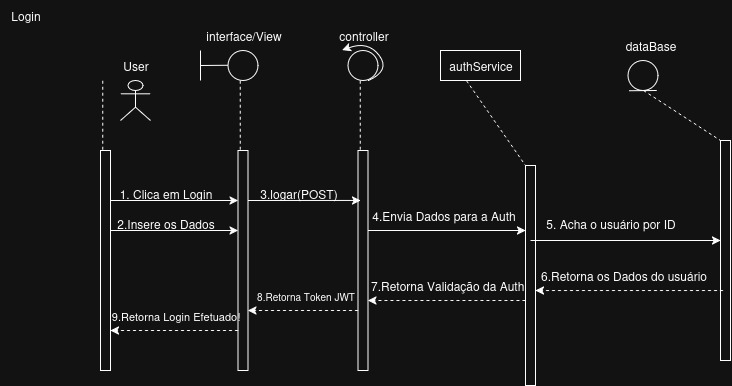
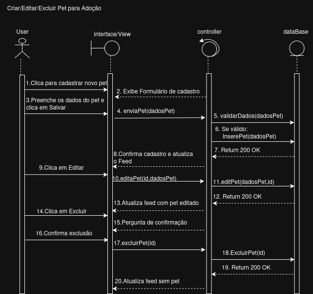

# Diagrama de Sequência

## **Introdução**

O **diagrama de sequência** é um dos principais diagramas de interação da **Unified Modeling Language (UML)**. Seu objetivo é ilustrar como os objetos de um sistema colaboram entre si ao longo do tempo para realizar uma funcionalidade específica. Diferente dos diagramas estruturais, ele foca no comportamento dinâmico do sistema, mostrando a ordem cronológica em que as mensagens são trocadas entre os participantes (atores e objetos).

Este diagrama é fundamental para detalhar casos de uso, modelando o fluxo de eventos passo a passo. Ele visualiza os participantes por meio de **raias (lifelines)** e as interações como **mensagens** enviadas entre elas, deixando claro quem chama quem e em que momento.

## **Metodologia**

A elaboração dos diagramas de sequência para a plataforma **"CuidaDeMim"** foi um esforço colaborativo realizado pelos quatro integrantes do grupo. A metodologia foi definida por meio de reuniões de trabalho, documentadas em atas, onde os principais fluxos de interação do sistema, como "Login" e "Gerenciamento de Pets", foram discutidos e modelados.

Para a construção dos diagramas, foi utilizada a ferramenta **Draw.io**. A escolha se deu por sua interface intuitiva e pelos recursos que facilitam a representação de fluxos temporais, permitindo modelar de forma clara os atores, os objetos (View, Controller, Service), suas raias e as mensagens trocadas entre eles para executar cada funcionalidade.

## **Tabela de Participação na Produção do Artefato**

| 
Nome do Integrante | 
Artefato | 
Descrição da Contribuição | 
Análise Crítica | 
Link Comprobatório |
| :--- | :--- | :--- | :--- | :--- |
| **Ian Costa** | Diagrama de Sequência Login e de CRUD dos PETS | Fui responsável por finalizar o diagrama, alterei o nome das etapas, enumerei etapas que não estavam numeradas e organizei a relação entre view,controller e model para que seja fiel a arquitetura. Deixei explícito os retornos e padronizei para seguirem a mesma nomenclatura.  | O diagrama de sequência mistura como o sistem funciona tecnicamente e mistura com o fluxo de negócio, permitindo o desenvolvedor ter uma visão holístico de uma sequência de passos do sistema. | commit
| **Erick** | Diagrama de Sequência Login | Contribuí com a modelagem do diagrama de sequência para o caso de uso de "Login", detalhando a comunicação entre o Controller, o Serviço de Autenticação e o Repositório de Usuários, incluindo o retorno de sucesso e falha. | O diagrama de login foi crucial para visualizar a separação de responsabilidades em uma funcionalidade crítica de segurança. Ficou evidente a importância de ter um serviço dedicado para autenticação, em vez de acoplar essa lógica ao Controller principal. | [Ata 01](https://unbarqdsw2025-2-turma01.github.io/2025.2-T01-G4_CuidaDeMim_Entrega_02/#/Projeto/IniciativasExtras/ata_01) |
| **Daniel** | Diagrama de Sequência de CRUD dos PETS | Fiquei encarregado de detalhar os fluxos alternativos e de exceção, como o que acontece quando um usuário tenta se cadastrar com um e-mail já existente ou quando os dados para o cadastro de um pet são inválidos, utilizando fragmentos `alt` da UML. | Focar nos fluxos de exceção nos ajudou a prever pontos de falha e a pensar em como a interface deveria responder a eles. O uso dos fragmentos `alt` foi fundamental para manter o diagrama limpo e legível, sem precisar criar um diagrama separado para cada cenário. | [Ata 01](https://unbarqdsw2025-2-turma01.github.io/2025.2-T01-G4_CuidaDeMim_Entrega_02/#/Projeto/IniciativasExtras/ata_01) |
| **Vinicíus** | Diagrama de Sequência de Adoção | Realizei a revisão final dos diagramas, garantindo a conformidade com a notação UML. Padronizei o estilo das mensagens (síncronas/assíncronas), o uso correto das raias (lifelines) e a clareza geral dos textos descritivos em todas as interações modeladas. | A padronização da notação foi um ponto importante para garantir que os diagramas fossem compreendidos por todos da mesma forma. No início, usávamos setas de forma inconsistente, o que poderia gerar ambiguidade sobre a natureza das chamadas entre os objetos. | [Ata 01](https://unbarqdsw2025-2-turma01.github.io/2025.2-T01-G4_CuidaDeMim_Entrega_02/#/Projeto/IniciativasExtras/ata_01) |

## **Resultados**

**Diagramas de Sequência:**

### Login

**Autor(es):** Erick, Ian e Daniel.

### CRUD de PETS

**Autor(es):** Erick, Ian e Daniel.

## **Gravação da Produção do Artefato**

<iframe src="https://unbbr.sharepoint.com/sites/ArqDSW-G4/_layouts/15/embed.aspx?UniqueId=21d47f94-0659-405d-8b6e-19969066efed&embed=%7B%22ust%22%3Atrue%2C%22hv%22%3A%22CopyEmbedCode%22%7D&referrer=StreamWebApp&referrerScenario=EmbedDialog.Create" width="640" height="360" frameborder="0" scrolling="no" allowfullscreen title="Elaboração do Diagrama de Componentes e do de Atividades-20250920_170650-Gravação de Reunião.mp4"></iframe>
<iframe src="https://unbbr.sharepoint.com/sites/ArqDSW-G4/_layouts/15/embed.aspx?UniqueId=69af963a-b0e6-4221-b931-5f6eeb389775&embed=%7B%22ust%22%3Atrue%2C%22hv%22%3A%22CopyEmbedCode%22%7D&referrer=StreamWebApp&referrerScenario=EmbedDialog.Create" width="640" height="360" frameborder="0" scrolling="no" allowfullscreen title="Elaboração do Diagrama de Componentes e do de Atividades-20250920_181215-Gravação de Reunião.mp4"></iframe>

## **Referências Bibliográficas**

> UML DIAGRAMS. Sequence Diagrams. Disponível em: https://www.uml-diagrams.org/sequence-diagrams.html. Acesso em: 15 set 2025.

> LUCIDCHART. O que é diagrama de sequência UML. Lucidchart, [s.d.]. Disponível em: https://www.lucidchart.com/pages/pt/o-que-e-diagrama-de-sequencia-uml. Acesso em: 22 set. 2025.

## **Histórico de versões**

| Versão | Data       | Descrição                                                                                             | Autores                            | Revisor |
| :--- | :--- | :--- | :--- | :--- |
| 1.0  | 22/09/2025 | Criação dos diagramas de Login e CRUD de PETS | Daniel, Erick, Ian   |   Todos os Autores    |
| 1.0  | 22/09/2025 | Criação dos diagramas de Login e CRUD de PETS | Vinícius   | Ian     |
