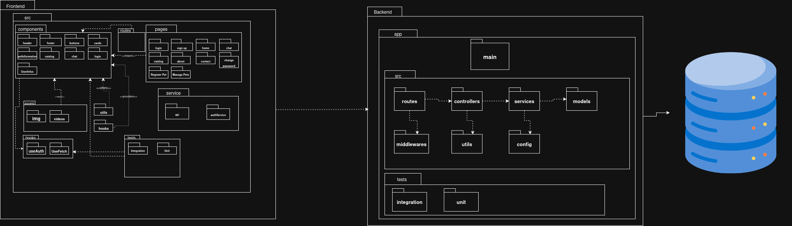

# Diagrama de Pacotes

## **Introdução**

O **diagrama de pacotes** é um dos diagramas estruturais da **Unified Modeling Language (UML)**, utilizado para organizar os elementos de um modelo em grupos lógicos chamados "pacotes". Sua principal função é gerenciar a complexidade de sistemas grandes, mostrando a organização e as dependências entre os diferentes módulos ou subsistemas.

Em vez de focar em classes individuais, este diagrama opera em um nível mais alto de abstração. Ele é essencial para visualizar a arquitetura do sistema, decompondo-o em partes coesas e de baixo acoplamento. Os pacotes podem representar camadas arquiteturais (como *Apresentação*, *Negócios*, *Dados*), módulos de funcionalidades ou qualquer outro agrupamento lógico que ajude a estruturar o projeto de forma clara e organizada.

## **Metodologia**

A elaboração do diagrama de pacotes para a plataforma **"CuidaDeMim"** foi um esforço colaborativo realizado pelos quatro integrantes do grupo. A metodologia foi definida por meio de reuniões de trabalho, documentadas em atas, onde a arquitetura em camadas e a organização lógica dos módulos do sistema foram discutidas e modeladas.

Para a construção do diagrama, foi utilizada a ferramenta **Draw.io**. A escolha se deu pela clareza visual que a ferramenta oferece para representar os pacotes principais (ex: `Front-end`, `Back-End`, `BD`), suas dependências ao descer no nível de granularidade (`<<import>>`, `<<access>>`) e a forma como os elementos do modelo estão organizados dentro de cada um, garantindo uma visão macro da arquitetura do software.

## **Tabela de Participação na Produção do Artefato**

### **Tabela de Participação na Elaboração do Diagrama de Pacotes**

| Nome do Membro | Contribuição | Significância da Contribuição para o Projeto (Excelente/Boa/Regular/Ruim/Nula) | Comprobatórios Claros (com link) |
| :--- | :--- | :--- | :--- |
| **Ian Costa Guimarães** | 1. Adição de alguns pacotes relacionados a testes, verificação e validação da arquitetura | Boa | Link da Reunião de Comprovação. [link](https://unbbr.sharepoint.com/:v:/s/ArqDSW-G4/EVZX3s5Sn5xPq1MgzgDDE8cBvpXOeuFIzkohujGpJpW13A?e=yD4WHR&nav=eyJyZWZlcnJhbEluZm8iOnsicmVmZXJyYWxBcHAiOiJTdHJlYW1XZWJBcHAiLCJyZWZlcnJhbFZpZXciOiJTaGFyZURpYWxvZy1MaW5rIiwicmVmZXJyYWxBcHBQbGF0Zm9ybSI6IldlYiIsInJlZmVycmFsTW9kZSI6InZpZXcifX0%3D). |
| **Erick Santos** | Iniciando a diagramação dos pacotes e a modelagem do frontend e seus componentes| Boa | Link de Comprovação. [link](https://drive.google.com/file/d/1pMnUKqdXmrA2jduIFZQstYKvGSis6H-D/view?usp=sharing). |
| **Vinicius Alves** | 1. Detalhamento do pacote `Backend` em sub-pacotes (`Controllers`, `Services`, `Services`, `Routes`). 2. Organização das classes do domínio dentro dos pacotes correspondentes. | Excelente |Link de Comprovação [link](https://unbbr-my.sharepoint.com/:v:/g/personal/190039116_aluno_unb_br/EWZ1IT4Mv3BLks2gzZXrhf8BhqOwTbk6L41DawDgjskWsg?nav=eyJyZWZlcnJhbEluZm8iOnsicmVmZXJyYWxBcHAiOiJPbmVEcml2ZUZvckJ1c2luZXNzIiwicmVmZXJyYWxBcHBQbGF0Zm9ybSI6IldlYiIsInJlZmVycmFsTW9kZSI6InZpZXciLCJyZWZlcnJhbFZpZXciOiJNeUZpbGVzTGlua0NvcHkifX0&e=PgsdYg). |

## **Resultados**

**Diagrama de Pacotes:**

**Autor(es):** Vinicius, Membro 2, Membro 3, Membro 4.

## **Gravação da Produção do Artefato**

<iframe src="https://unbbr-my.sharepoint.com/:v:/g/personal/190039116_aluno_unb_br/EWZ1IT4Mv3BLks2gzZXrhf8BhqOwTbk6L41DawDgjskWsg?nav=eyJyZWZlcnJhbEluZm8iOnsicmVmZXJyYWxBcHAiOiJPbmVEcml2ZUZvckJ1c2luZXNzIiwicmVmZXJyYWxBcHBQbGF0Zm9ybSI6IldlYiIsInJlZmVycmFsTW9kZSI6InZpZXciLCJyZWZlcnJhbFZpZXciOiJNeUZpbGVzTGlua0NvcHkifX0&e=PgsdYg" width="640" height="360" frameborder="0" scrolling="no" allowfullscreen title="Diagrama de pacotes vinicius 1"></iframe>
<iframe src="https://unbbr-my.sharepoint.com/:v:/g/personal/190039116_aluno_unb_br/ER_jHF5_RUpFg_LpX1MvaYwBilSsLv8KPPKO6KafL7z07Q?nav=eyJyZWZlcnJhbEluZm8iOnsicmVmZXJyYWxBcHAiOiJPbmVEcml2ZUZvckJ1c2luZXNzIiwicmVmZXJyYWxBcHBQbGF0Zm9ybSI6IldlYiIsInJlZmVycmFsTW9kZSI6InZpZXciLCJyZWZlcnJhbFZpZXciOiJNeUZpbGVzTGlua0NvcHkifX0&e=ssLHGQ" width="640" height="360" frameborder="0" scrolling="no" allowfullscreen title="Diagrama de pacotes vinicius 2"></iframe>

## **Referências Bibliográficas**

> UML DIAGRAMS. Package Diagrams. Disponível em: https://www.uml-diagrams.org/package-diagrams.html. Acesso em: 22 set 2025.
> LUCIDCHART. O que é um diagrama de pacotes UML?. Lucidchart, [s.d.]. Disponível em: https://www.lucidchart.com/pages/pt/diagrama-de-pacotes-uml. Acesso em: 22 set. 2025.

## **Histórico de versões**

| Versão | Data       | Descrição                                                                                             | Autores                            | Revisor |
| :--- | :--- | :--- | :--- | :--- |
| 1.0  | 22/09/2025 | Criação do documento e do diagrama de pacotes  | Daniel, Erick, Ian, Vinicíus e José  |   Todos Presentes   
| 1.1  | 22/09/2025 | Adição do link comprobatorio | Erick |   Ian   
| 1.2  | 22/09/2025 | Adição do link comprobatorio | Vinicius |   Ian   