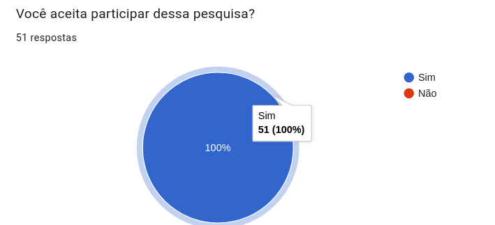

# Questionário com Usuários – Iniciativa Extra

## **Introdução**

Com o objetivo de validar a proposta da plataforma **"CuidaDeMim"**, foi aplicado um questionário online para potenciais usuários.  
A pesquisa teve como foco compreender as percepções, necessidades e preferências relacionadas ao processo de adoção de animais e às funcionalidades esperadas em uma plataforma digital de adoção.

Ao todo, **51 pessoas participaram do questionário**, trazendo insights valiosos sobre perfil demográfico, experiência prévia com adoções, preocupações, funcionalidades desejadas e expectativas quanto ao uso da plataforma.

---

## **Metodologia**

A elaboração do questionário foi realizada pela equipe de desenvolvimento, utilizando a ferramenta **Google Forms** para coleta de dados.  
As perguntas foram elaboradas para abranger aspectos quantitativos (perguntas fechadas com múltipla escolha e escala Likert) e qualitativos (preferências e prioridades).

Os resultados foram organizados em gráficos e tabelas, permitindo a análise das tendências de resposta.  
Este relatório apresenta os principais achados da pesquisa, acompanhados dos gráficos gerados automaticamente pelo Google Forms.

---

## **Tabela de Participação na Produção do Artefato**

| 
Nome do Integrante    | 
Artefato | 
Descrição da Contribuição | 
Análise Crítica | 
Link Comprobatório |
| --- | ---- | --------- | ----| -------------------------- |
| **José André Rabelo Rocha** | Questionário de Validação | Responsável por estruturar e aplicar o questionário, além de consolidar os resultados em gráficos e organizar este relatório em formato Markdown. | O questionário trouxe insights práticos que confirmam a viabilidade da plataforma e revelam pontos de atenção, como segurança e engajamento dos usuários. | [Google Forms Resultados](#) |

## **Resultados**

### **1. Aceite de Participação**

---

### **2. Perfil dos Respondentes**
- **Faixa Etária**  

<iframe width="600" height="371" seamless frameborder="0" scrolling="no" src="https://docs.google.com/spreadsheets/d/e/2PACX-1vR8RMorusjcFQJ5tqcvEDYtzildwMpF2LI3xR0lo-XQcmzEg2ilqGCVs4Q1bBhWLNZIUYjbytnoUIyX/pubchart?oid=24731314&amp;format=interactive"></iframe>

- **Já adotou algum animal de estimação?**  

<iframe width="600" height="371" seamless frameborder="0" scrolling="no" src="https://docs.google.com/spreadsheets/d/e/2PACX-1vR8RMorusjcFQJ5tqcvEDYtzildwMpF2LI3xR0lo-XQcmzEg2ilqGCVs4Q1bBhWLNZIUYjbytnoUIyX/pubchart?oid=1769356852&amp;format=interactive"></iframe>

- **Caso tenha adotado, como foi o processo de adoção?**  

<iframe width="600" height="371" seamless frameborder="0" scrolling="no" src="https://docs.google.com/spreadsheets/d/e/2PACX-1vR8RMorusjcFQJ5tqcvEDYtzildwMpF2LI3xR0lo-XQcmzEg2ilqGCVs4Q1bBhWLNZIUYjbytnoUIyX/pubchart?oid=2144563546&amp;format=interactive"></iframe>

---

### **3. Intenção de Adoção**
- **Você estaria interessado em adotar um cachorro no futuro?**  

<iframe width="600" height="371" seamless frameborder="0" scrolling="no" src="https://docs.google.com/spreadsheets/d/e/2PACX-1vR8RMorusjcFQJ5tqcvEDYtzildwMpF2LI3xR0lo-XQcmzEg2ilqGCVs4Q1bBhWLNZIUYjbytnoUIyX/pubchart?oid=61838615&amp;format=interactive"></iframe>

- **Em uma escala de 1 a 5, qual sua preocupação em garantir que a adoção seja responsável e segura?**  

<iframe width="600" height="371" seamless frameborder="0" scrolling="no" src="https://docs.google.com/spreadsheets/d/e/2PACX-1vR8RMorusjcFQJ5tqcvEDYtzildwMpF2LI3xR0lo-XQcmzEg2ilqGCVs4Q1bBhWLNZIUYjbytnoUIyX/pubchart?oid=1754130928&amp;format=interactive"></iframe>

---

### **4. Funcionalidades da Plataforma**
- **O que você considera mais importante em uma plataforma de adoção?**  

<iframe width="600" height="371" seamless frameborder="0" scrolling="no" src="https://docs.google.com/spreadsheets/d/e/2PACX-1vR8RMorusjcFQJ5tqcvEDYtzildwMpF2LI3xR0lo-XQcmzEg2ilqGCVs4Q1bBhWLNZIUYjbytnoUIyX/pubchart?oid=1786269367&amp;format=interactive"></iframe>

- **Gostaria de ter acesso a filtros de busca para encontrar o cachorro ideal?**  

<iframe width="600" height="371" seamless frameborder="0" scrolling="no" src="https://docs.google.com/spreadsheets/d/e/2PACX-1vR8RMorusjcFQJ5tqcvEDYtzildwMpF2LI3xR0lo-XQcmzEg2ilqGCVs4Q1bBhWLNZIUYjbytnoUIyX/pubchart?oid=445769243&amp;format=interactive"></iframe>

- **Filtros mais relevantes para os usuários**  

<iframe width="600" height="371" seamless frameborder="0" scrolling="no" src="https://docs.google.com/spreadsheets/d/e/2PACX-1vR8RMorusjcFQJ5tqcvEDYtzildwMpF2LI3xR0lo-XQcmzEg2ilqGCVs4Q1bBhWLNZIUYjbytnoUIyX/pubchart?oid=1135598127&amp;format=interactive"></iframe>

- **Utilidade de um catálogo (feed) de animais disponíveis para adoção**  

<iframe width="600" height="371" seamless frameborder="0" scrolling="no" src="https://docs.google.com/spreadsheets/d/e/2PACX-1vR8RMorusjcFQJ5tqcvEDYtzildwMpF2LI3xR0lo-XQcmzEg2ilqGCVs4Q1bBhWLNZIUYjbytnoUIyX/pubchart?oid=1688039070&amp;format=interactive"></iframe>

- **Desejo por funcionalidades de comunidade (ex.: vaquinhas coletivas, registro de pets na rua, ajuda a animais perdidos)**  

<iframe width="600" height="371" seamless frameborder="0" scrolling="no" src="https://docs.google.com/spreadsheets/d/e/2PACX-1vR8RMorusjcFQJ5tqcvEDYtzildwMpF2LI3xR0lo-XQcmzEg2ilqGCVs4Q1bBhWLNZIUYjbytnoUIyX/pubchart?oid=1612034798&amp;format=interactive"></iframe>

---

### **5. Segurança e Confiabilidade**
- **Nível de preocupação em relação à segurança dos dados**  

<iframe width="600" height="371" seamless frameborder="0" scrolling="no" src="https://docs.google.com/spreadsheets/d/e/2PACX-1vR8RMorusjcFQJ5tqcvEDYtzildwMpF2LI3xR0lo-XQcmzEg2ilqGCVs4Q1bBhWLNZIUYjbytnoUIyX/pubchart?oid=1051577701&amp;format=interactive"></iframe>

---

### **6. Comunicação e Apoio**
- **Gostaria de conversar diretamente com ONGs ou doadores pela própria plataforma (chat)?**  

<iframe width="600" height="371" seamless frameborder="0" scrolling="no" src="https://docs.google.com/spreadsheets/d/e/2PACX-1vR8RMorusjcFQJ5tqcvEDYtzildwMpF2LI3xR0lo-XQcmzEg2ilqGCVs4Q1bBhWLNZIUYjbytnoUIyX/pubchart?oid=1507402680&amp;format=interactive"></iframe>

- **Interesse em apoiar financeiramente ONGs pela plataforma (doações, vaquinhas)**  

<iframe width="600" height="371" seamless frameborder="0" scrolling="no" src="https://docs.google.com/spreadsheets/d/e/2PACX-1vR8RMorusjcFQJ5tqcvEDYtzildwMpF2LI3xR0lo-XQcmzEg2ilqGCVs4Q1bBhWLNZIUYjbytnoUIyX/pubchart?oid=713266561&amp;format=interactive"></iframe>

---

### **7. Experiência do Usuário**
- **Em uma escala de 1 a 5, quanto a experiência de uso (design simples, navegação fácil) influencia na decisão de usar a plataforma?**  

<iframe width="600" height="371" seamless frameborder="0" scrolling="no" src="https://docs.google.com/spreadsheets/d/e/2PACX-1vR8RMorusjcFQJ5tqcvEDYtzildwMpF2LI3xR0lo-XQcmzEg2ilqGCVs4Q1bBhWLNZIUYjbytnoUIyX/pubchart?oid=744761000&amp;format=interactive"></iframe>

- **Dispositivo mais utilizado para acessar a plataforma CuidaDeMim**  

<iframe width="600" height="371" seamless frameborder="0" scrolling="no" src="https://docs.google.com/spreadsheets/d/e/2PACX-1vR8RMorusjcFQJ5tqcvEDYtzildwMpF2LI3xR0lo-XQcmzEg2ilqGCVs4Q1bBhWLNZIUYjbytnoUIyX/pubchart?oid=526274497&amp;format=interactive"></iframe>

- **Desejo de receber notificações sobre novos animais disponíveis para adoção**  

<iframe width="600" height="371" seamless frameborder="0" scrolling="no" src="https://docs.google.com/spreadsheets/d/e/2PACX-1vR8RMorusjcFQJ5tqcvEDYtzildwMpF2LI3xR0lo-XQcmzEg2ilqGCVs4Q1bBhWLNZIUYjbytnoUIyX/pubchart?oid=679559257&amp;format=interactive"></iframe>

- **Frequência preferida para recebimento de notificações**  

<iframe width="600" height="371" seamless frameborder="0" scrolling="no" src="https://docs.google.com/spreadsheets/d/e/2PACX-1vR8RMorusjcFQJ5tqcvEDYtzildwMpF2LI3xR0lo-XQcmzEg2ilqGCVs4Q1bBhWLNZIUYjbytnoUIyX/pubchart?oid=670204610&amp;format=interactive"></iframe>

---

## **Análise Crítica**

A pesquisa demonstrou que:
- A maioria dos respondentes já teve contato prévio com adoção de animais.  
- Há uma **alta preocupação com a segurança e responsabilidade no processo de adoção**.  
- Funcionalidades mais valorizadas:  
  - Filtros de busca para encontrar o animal ideal.  
  - Catálogo (feed) atualizado de pets disponíveis.  
  - Canal de comunicação direto com ONGs/doadores.  
  - Recursos de comunidade e colaboração financeira.  
- O **celular** foi identificado como o principal dispositivo de acesso.  
- Os usuários valorizam fortemente **design simples, navegação intuitiva e segurança de dados**.  

Esses achados confirmam a **relevância da proposta da plataforma "CuidaDeMim"** e fornecem insumos importantes para priorização de requisitos e funcionalidades.

## **Histórico de versões**

| Versão | Data       | Descrição                                                                                             | Autores                            | Revisor |
| ------ | ---------- | ----------------------------------------------------------------------------------------------------- | -------------------------------- | ------- |
| 1.0  | 22/09/2025 | Criação do documento                  | [José André](https://github.com/joseandre25)  |       |

