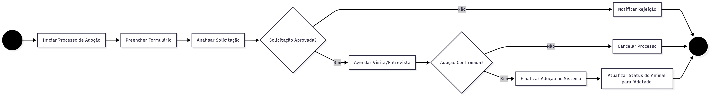
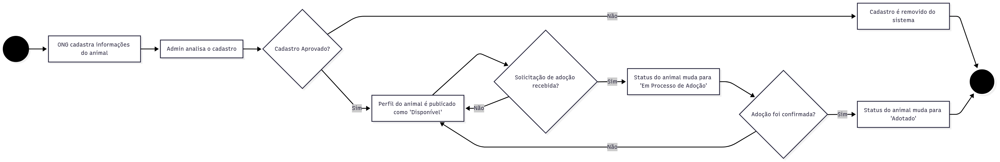

# 1.8. Diagrama de Estados

## **Introdução**

Este documento apresenta os Diagramas de Estado do projeto **"CuidaDeMim"**, desenvolvidos na disciplina de Arquitetura e Desenho de Software. Os diagramas descrevem o ciclo de vida e o comportamento dos principais objetos do sistema, oferecendo uma visão detalhada dos diferentes estados que eles podem assumir e das transições que ocorrem entre esses estados.

## **Metodologia**

O Diagrama de Estados é uma técnica da UML (Unified Modeling Language) utilizada para modelar o comportamento de um único objeto ao longo do tempo. Ele especifica a sequência de estados pelos quais um objeto passa em resposta a eventos. A construção dos diagramas seguiu os padrões da UML 2.5 para representar estados, transições e eventos.

Os diagramas aqui apresentados foram produzidos a partir da análise dos requisitos do sistema, focando nos objetos com os comportamentos mais complexos e dinâmicos. Nesta entrega, a equipe modelou o ciclo de vida de **dois objetos centrais e complementares**:

1.  Um diagrama para a **"Solicitação de Adoção"**, que representa o ciclo de vida do processo em si.
2.  Um diagrama para o **"Animal"**, que representa o ciclo de vida da entidade que sofre o impacto do processo de adoção.

Essa abordagem dupla permite uma compreensão profunda de como o sistema gerencia tanto o processo quanto a entidade principal envolvida.

## **Tabela de Participação**

| Nome do Integrante | Contribuição | Análise Crítica da Contribuição |
| :--- | :--- | :--- |
| **Wallyson Souza** | Fui responsável por modelar o ciclo de vida da "Solicitação de Adoção", identificando os principais estados (como 'Aguardando Análise', 'Aprovada') e os eventos que causam as transições entre eles. | Mapear o ciclo de vida do processo foi essencial para definir as regras de negócio. Um desafio foi garantir que todos os caminhos, incluindo os de falha (rejeição, cancelamento), estivessem contemplados, o que tornou o modelo mais robusto. |
| **Mateus de Castro** | Contribuí com a modelagem do ciclo de vida do "Animal", definindo seus estados ('Disponível', 'Em Processo', 'Adotado') e garantindo que as transições fossem consistentes com os eventos do diagrama de "Solicitação de Adoção". | A criação do diagrama de estado do animal foi crucial para visualizar o impacto direto do processo de adoção. Acredito que a sincronia entre os dois diagramas foi o ponto mais importante, mostrando como a conclusão de um processo afeta diretamente o estado do animal. |
| **Davi Aguiar** | Fui responsável pelo refinamento final dos dois diagramas, aplicando a notação correta da UML, e pela elaboração da documentação. Também ajudei a validar se todos os estados terminais estavam corretamente representados. | A revisão e a padronização dos diagramas foram importantes para a clareza da documentação. Uma melhoria futura seria usar uma ferramenta que pudesse simular as transições de estado para validar a lógica de forma ainda mais eficaz antes da implementação. |

## **Resultados**

### Diagrama 1: Ciclo de Vida da "Solicitação de Adoção"

### Diagrama 2: Ciclo de Vida do "Animal"

## **Observações**

O trabalho de criação e refinamento dos diagramas foi conduzido de forma **assíncrona** pelo trio **Wallyson Souza, Mateus de Castro e Davi Aguiar**. O processo envolveu discussões para a identificação dos objetos e seus respectivos estados, modelagem inicial e rodadas de revisão para garantir a precisão e a consistência entre os artefatos.

## **Histórico de Versão**

| Versão | Data | Descrição | Autor(es) | Revisor(es) |
| :--: | :--: | :-- | :-- | :--: |
| 0.1 | 20/09/2025 | Criação da estrutura do documento e modelagem do estado da "Solicitação de Adoção" | Wallyson Souza | Mateus de Castro |
| 0.2 | 21/09/2025 | Adição do diagrama de estado do "Animal" e revisão da consistência entre os modelos | Mateus de Castro | Davi Aguiar |
| 1.0 | 21/09/2025 | Versão final, consolidação dos dois diagramas e elaboração da documentação completa | Davi Aguiar, Wallyson Souza | Mateus de Castro |